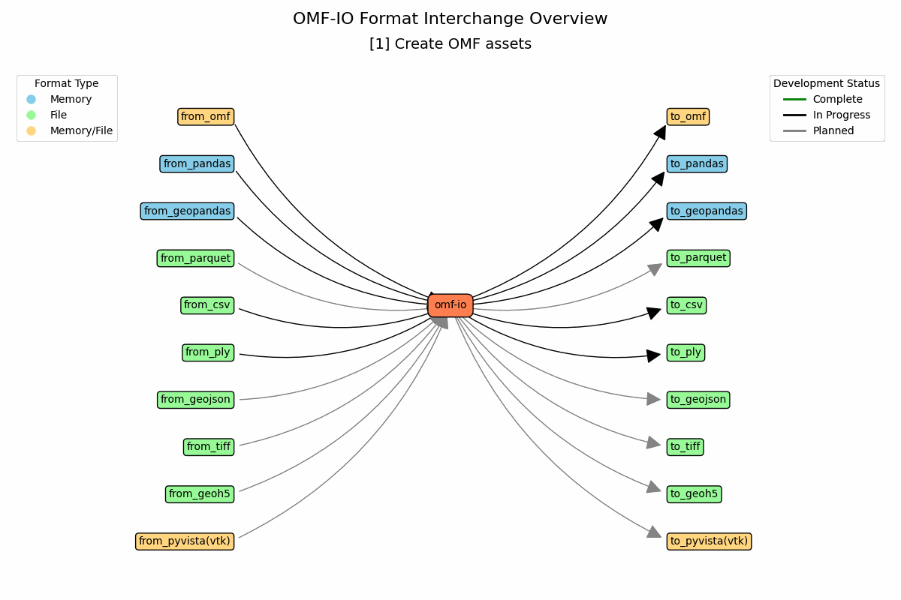

Welcome to omf-io's documentation!
==================================

.. note::

   This package is a work in progress and is not yet ready for production use.
   Please check back later for updates.

   This is not a GMG Group managed project, but leverages the great work by all contributors of the OMF project.

.. include:: ../../README.md
   :parser: myst_parser.sphinx_

.. toctree::
   :maxdepth: 2
   :caption: Contents:
   :hidden:
   :glob:

   usage/installation
   usage/quickstart
   user_guide
   auto_examples/index
   glossary/*
   api/modules
   todo
   license/*

Indices and tables
==================

* :ref:`genindex`
* :ref:`modindex`
* :ref:`search`
